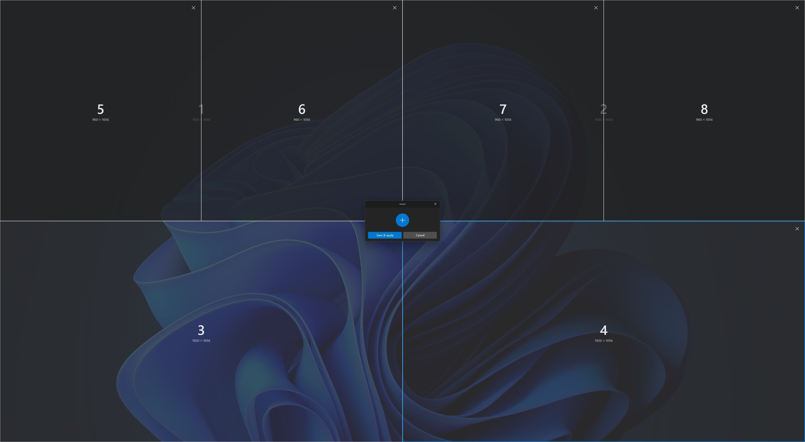

# Microsoft PowerToys

> Microsoft PowerToys is a set of utilities for power users to tune and streamline their Windows experience for greater productivity. For more info on [PowerToys overviews and how to use the utilities](https://aka.ms/powertoys-docs), or any other tools and resources for [Windows development environments](https://learn.microsoft.com/windows/dev-environment/overview), head over to [learn.microsoft.com](https://aka.ms/powertoys-docs)!  
> &mdash; PowerToys README.md on GitHub

## How to Install

The recommended method is to download the latest EXE from the [GitHub Releases](https://github.com/microsoft/PowerToys/releases) page

## How to Configure

Once it is installed, you have two options for running it. The default is to run with user permissions, but some features will not work without running it with elevated permissions.

To run with elevated permissions, your logged-in account will require administrative permissions. If you have a separate account you use for elevated access, you will need to manually switch PowerToys to run as admin every time it is launched (Usually every reboot).

## How to Use

PowerToys has several utilities that can do a variety of tasks. Here are just a few that I make regular use of

### FancyZones

I find this utility is useful if you have a large monitor, and you want more than just the 4 corner zones. You can even have overlapping zones.

So, for my setup, I have it divided into 4 equal zones, then the top two zones are again divided in half. This allows me to have 4 half-size displays, which I use for chat programs and email, then 2 bigger displays at the bottom for things that need more screen space, like my browser or VS Code. When I need a third large area, I can cover 2 of the half-size displays with one window.

Here is what the zones look like:

You can see the one and two partly obscured by the line from the overlapping zones along the top.

### Paste as Plain Text

This is useful when you just need unformatted text

### Awake

This utility gives you options on keeping your computer awake and how long it should stay awake for

### Mouse Utilities

This has various options related to the mouse and pointer, which can help you find your mouse or highlight it when you click. The latter can be great for screen recording.
