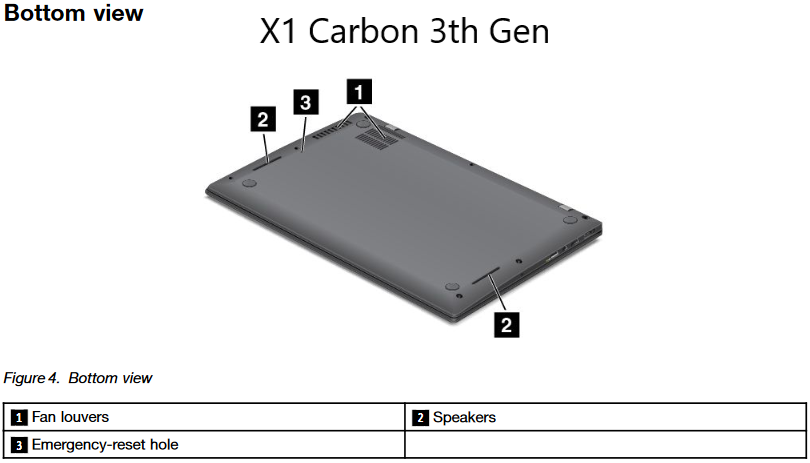
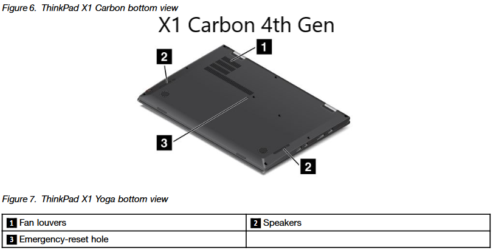
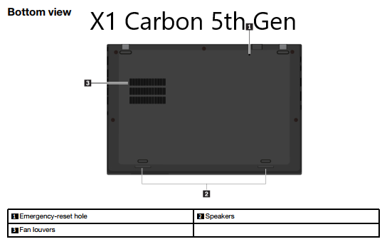
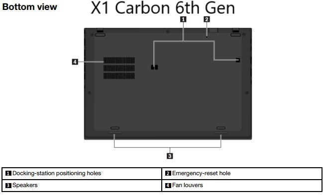
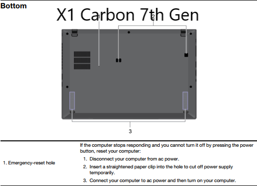
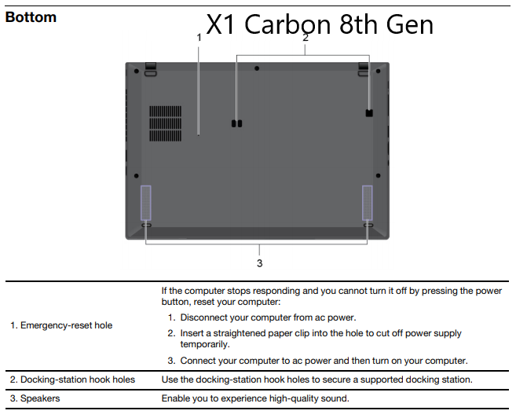
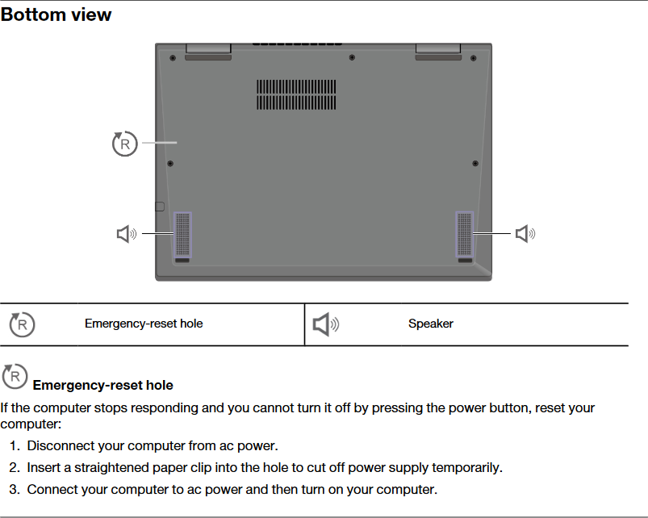
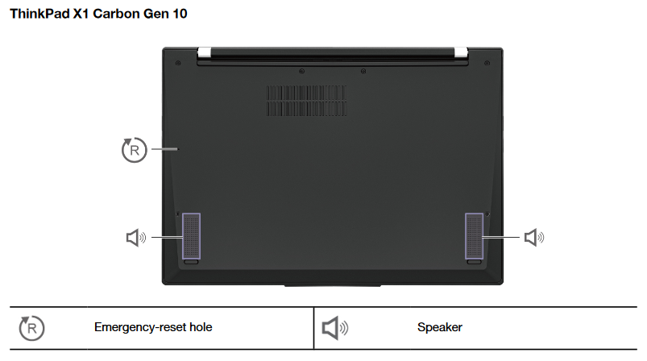

Lenoovo X1 Carbons have a built-in battery that is not removable by the end user. While this allows the laptop to be thinner, it makes it hard to resolve issues that require unplugging the battery and plugging it back in.

To resolve this, Lenovo includes a small reset button on the motherboard, which can be accessed from the bottom of the laptop. 

## Prerequisites

The reset hole is very small, so you or the person with the machine will need something small to fit. I find a stud earring, paperclip, push-pin or similar should work.

## Process

Here are the steps to reset an X1 Carbon. The location of the reset button varies based on the generation.

1. Shut off the computer
2. Unplug everything connected to it (especially the power cord or any docks supplying power!)
3. Turn the computer upside down
4. The below image indicates the location of the emergency reset hole.
5. Using something small, insert it into the opening, and hold it for about 10 seconds
6. Turn the computer back over, plug everything back in, and power it on.

## Reference Images

The following images were taken from each model's user manual, then edited to add the model name to the image. All applicable copyright information for the images can be found in the user manual. 

### X1 Carbon 3rd Gen

### X1 Carbon 4th Gen

### X1 Carbon 5th Gen

### X1 Carbon 6th Gen

### X1 Carbon 7th Gen

### X1 Carbon 8th Gen

### X1 Carbon 9th Gen

### X1 Carbon 10th Gen

