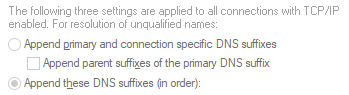

# Fix for Greyed-out DNS Suffixes

If this is what the DNS area in Networking looks like:  

This will commonly cause slow connection speeds when attempting to load any websites/Outlook from outside of a corporate network environment (from home, etc)

Open the registry and remove entries from the following location:
`HKEY_LOCAL_MACHINE\SOFTWARE\Policies\Microsoft\Windows NT\DNSClient\"SearchList"="domain1,domain2,domain3"`
Reboot the computer to apply the changes and retest connection speeds

[Source](https://social.technet.microsoft.com/Forums/ie/en-US/76d07f31-62d6-4648-a3e2-7e6e16791363/quotappend-these-dns-suffixesquot-not-available?forum=w7itpronetworking)
